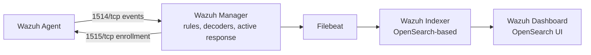

# 🛡️ Wazuh SOC Fundamentals Lab

> **A theory-to-practice learning project for building foundational SOC analyst skills with Wazuh — SIEM/XDR concepts, deployment models, and hands-on detection tasks.**

<p align="center">


</p>

---

## 📖 About This Project

This repository is a self-study guide for learning **Wazuh**, an open-source SIEM/XDR platform, from the ground up.

It's organized the way a fresher SOC analyst should actually learn the tool: understand the theory first (what Wazuh is, how it's built, what it can do), then work through a **beginner task list** to get comfortable navigating the dashboard, then move on to **intermediate practicals** that involve generating real alerts, writing detection rules, and practicing incident triage.

---

## 🎯 Objectives

- Understand SIEM/XDR concepts and where Wazuh fits
- Learn Wazuh's architecture and core components
- Understand rules, decoders, and alert severity
- Learn Wazuh's deployment options
- Practice navigating a real SIEM dashboard
- Perform basic detection engineering (writing/tuning rules and decoders)
- Practice the SOC alert triage workflow

---

## 🚀 Learning Outcomes

By working through this repo, you should come away understanding:

- ✅ SIEM vs EDR vs XDR
- ✅ Wazuh architecture (Manager, Agent, Indexer, Dashboard)
- ✅ Log collection & alert generation
- ✅ File Integrity Monitoring (FIM)
- ✅ Vulnerability Detection
- ✅ Security Configuration Assessment (SCA)
- ✅ Detection Engineering (rules, decoders, tuning)
- ✅ MITRE ATT&CK mapping
- ✅ Compliance monitoring (PCI DSS, HIPAA, GDPR, NIST)
- ✅ Incident triage basics

---

## 📚 Table of Contents

- [About This Project](#-about-this-project)
- [Objectives](#-objectives)
- [Learning Outcomes](#-learning-outcomes)
- [What is Wazuh?](#-what-is-wazuh)
- [SIEM vs EDR vs XDR](#️-siem-vs-edr-vs-xdr)
- [Wazuh Architecture](#️-wazuh-architecture)
- [Core Capabilities](#-core-capabilities)
- [Rules, Decoders & Alerts](#-rules-decoders--alerts)
- [Compliance Frameworks](#-compliance-frameworks)
- [Deployment Methods](#-deployment-methods)
- [Beginner Practical Tasks](#-beginner-practical-tasks)
- [Intermediate SOC Analyst Practicals](#-intermediate-soc-analyst-practicals)
- [Progress Tracker](#-progress-tracker)
- [License](#-license)
- [Author](#-author)

---

## ❓ What is Wazuh?

**Wazuh** is a free, open-source **SIEM (Security Information and Event Management)** and **XDR (Extended Detection and Response)** platform. It collects, analyzes, and correlates log and telemetry data from endpoints, servers, network devices, and cloud services to detect threats, monitor system integrity, and support incident response and compliance.

Wazuh started as a fork of OSSEC (an open-source HIDS) and has since evolved into a full security monitoring stack combining:
- Log-based intrusion detection
- File Integrity Monitoring (FIM)
- Vulnerability detection
- Security configuration assessment
- Active response (automated remediation)
- Cloud and container security monitoring

### Why organizations use Wazuh
| Need | How Wazuh Helps |
|---|---|
| Centralized visibility | Collects logs from Windows, Linux, macOS, cloud, network devices |
| Threat detection | Correlates events against a rule base and MITRE ATT&CK |
| Compliance | Pre-built rules mapped to PCI DSS, GDPR, HIPAA, NIST 800-53 |
| Cost | 100% open source, no per-agent licensing fee |
| Incident response | Active response module can block IPs, kill processes, etc. |

---

## ⚖️ SIEM vs EDR vs XDR

Wazuh is often described as "SIEM + XDR" because it blends traits of all three categories.

| Feature | SIEM | EDR | XDR |
|---|---|---|---|
| Full form | Security Information and Event Management | Endpoint Detection and Response | Extended Detection and Response |
| Primary focus | Log collection, correlation, analysis | Endpoint monitoring and protection | Unified detection across multiple security layers |
| Data sources | Servers, apps, firewalls, cloud, network devices | Windows/Linux/macOS endpoints | Endpoints, network, cloud, identity, email |
| Response capability | Alert generation | Endpoint isolation, remediation | Automated response across integrated tools |
| Examples | Splunk, QRadar, Elastic SIEM | CrowdStrike Falcon, Defender for Endpoint | Microsoft Defender XDR, Cortex XDR, Wazuh |

Wazuh is unusual in that a single open-source platform covers log-based SIEM detection **and** endpoint-level EDR-style monitoring (FIM, process/registry visibility via Sysmon, vulnerability scanning), which is why it's marketed as an XDR platform rather than a plain SIEM.

---

## 🏛️ Wazuh Architecture

Wazuh follows a **manager–agent** model with a separate indexing and visualization layer.




### Components

- **Wazuh Agent** — lightweight software on the monitored endpoint (Windows/Linux/macOS). Collects logs, monitors files (FIM), runs vulnerability scans, executes SCA checks, and sends data securely to the manager.
- **Wazuh Manager (Server)** — the brain of the deployment. Receives agent data, decodes and analyzes it using rules and decoders, generates alerts, manages agent registration and active response.
- **Wazuh Indexer** — based on OpenSearch. Stores and indexes all alert/event data for fast searching.
- **Filebeat** — ships alert data from the Manager to the Indexer.
- **Wazuh Dashboard** — web UI for visualization, searching alerts, managing agents, and viewing modules like FIM, Vulnerability Detection, SCA, and MITRE ATT&CK.

---

## 🚀 Core Capabilities

| Module | Description |
|---|---|
| **Log Data Analysis** | Collects and analyzes logs from OS, applications, and devices |
| **File Integrity Monitoring (FIM)** | Detects creation, modification, deletion of monitored files/registry keys |
| **Vulnerability Detection** | Scans installed software against CVE feeds to find known vulnerabilities |
| **Security Configuration Assessment (SCA)** | Audits system hardening against CIS benchmarks |
| **Malware Detection** | Rootcheck and integration with YARA/VirusTotal |
| **Active Response** | Automated actions (block IP via firewall, disable account) triggered by alerts |
| **Cloud Security Monitoring** | AWS, Azure, GCP, Office 365 log ingestion |
| **Container Security** | Docker/Kubernetes monitoring |
| **Regulatory Compliance** | Pre-mapped rules for PCI DSS, HIPAA, GDPR, NIST 800-53 |
| **MITRE ATT&CK Mapping** | Alerts are tagged with corresponding ATT&CK techniques/tactics |
| **Threat Intelligence** | Enriches alerts using feeds like VirusTotal, AbuseIPDB, MISP, AlienVault OTX |

### Common Integrations (reference / future expansion)
- **Sysmon** – richer Windows telemetry (process creation, network connections, registry, DLL loads)
- **Suricata / Zeek** – network-based IDS/NSM
- **VirusTotal / MISP / AbuseIPDB** – threat intel enrichment
- **TheHive** – incident case management
- **Shuffle** – SOAR automation for repetitive response tasks

---

## 🔎 Rules, Decoders & Alerts

- **Decoders** parse raw log lines into structured fields (e.g., extracting `srcip`, `user`, `event_id`).
- **Rules** match decoded fields against conditions to generate alerts.
- **Rule Levels (0–16)** indicate severity:

| Level | Meaning |
|---|---|
| 0 | Ignored, no action |
| 3–4 | Low severity (informational) |
| 5–7 | Medium severity (suspicious activity) |
| 8–12 | High severity (likely attack) |
| 13–16 | Critical (severe attack / compromise) |

Rules live in `/var/ossec/ruleset/rules/` (default) and `/var/ossec/etc/rules/` (custom — always edit custom files, never default ones). Custom rules are written in XML with IDs ≥ 100000 to avoid conflicts:

```xml
<group name="local,custom_rules,">
  <rule id="100010" level="10">
    <if_group>authentication_failed</if_group>
    <same_source_ip />
    <description>Possible brute force attack detected</description>
    <mitre>
      <id>T1110</id>
    </mitre>
  </rule>
</group>
```

---

## 📋 Compliance Frameworks

Wazuh dashboard includes dedicated views for:
- **PCI DSS** – payment card data security
- **GDPR** – data protection for EU citizens
- **HIPAA** – healthcare data protection
- **NIST 800-53** – US federal security controls
- **TSC** – Trust Services Criteria (SOC 2)

Alerts are automatically tagged with the relevant compliance requirement IDs, making audit reporting easier.

---

## 🐳 Deployment Methods

| Deployment | Description | Recommended For |
|---|---|---|
| **Single Node** | All components (Manager, Indexer, Dashboard) on one server | Home labs & small organizations |
| **Multi Node** | Distributed architecture — separate Manager, Indexer, and Dashboard nodes with load balancing | Enterprises, high availability |
| **Docker** | Containerized deployment using the official Docker Compose stack | Learning, testing, repeatable home labs |
| **OVA Appliance** | Preconfigured virtual machine with everything installed | Quick evaluation/demos |
| **Cloud Deployment** | Cloud-hosted installation (AWS, Azure, GCP) | Cloud-native environments |

Each method reaches the same end state — a Manager listening on 1514/1515 for agents — so the choice mostly comes down to how much you want to manage yourself versus how quickly you want something running.

---

## 🟢 Beginner Practical Tasks

Start by just **navigating the platform** — this is exactly how a Tier 1 SOC analyst spends their first days on the job. No configuration changes needed for most of these; just explore and take notes.

- [ ] **Task 1 — Log In and Tour the Dashboard**: log in as `admin`, click through Threat Hunting, Integrity Monitoring, Vulnerability Detection, SCA, MITRE ATT&CK, and Agents. Write one sentence per module on what it's for.
- [ ] **Task 2 — Check Agent Status**: find your agent under **Agents**, note its status, OS, IP, version, and which modules are enabled.
- [ ] **Task 3 — Explore the Security Events Table**: sort by rule level, open the highest-severity alert, and identify `rule.id`, `rule.description`, `agent.name`.
- [ ] **Task 4 — Understand Alert Anatomy**: locate `timestamp`, `rule.level`, `rule.groups`, `full_log`, `agent.name` in an alert and describe what happened in plain English.
- [ ] **Task 5 — Browse Vulnerability Detection**: note how many vulnerabilities are found and the highest CVSS score present.
- [ ] **Task 6 — Browse the MITRE ATT&CK View**: find one tactic and one technique, and note which alerts are already mapped to it.
- [ ] **Task 7 — Check Agent Inventory**: review installed software, running processes, and open ports collected from the endpoint.
- [ ] **Task 8 — Read (Don't Edit) an Existing Detection Rule**: find the rule that fired for the alert from Task 4, read its XML definition, and identify its condition, severity, and MITRE tag. This is your first exposure to detection engineering.

> **Goal:** by the end, you should be able to answer "where do I find X in Wazuh?" without help.

---

## 🟡 Intermediate SOC Analyst Practicals

Once you're comfortable navigating the dashboard, these exercises involve generating real events, writing detections, and practicing triage.

- [ ] **Practical 1 — Brute Force Simulation**: fail a login 5–6 times, then find and analyze the resulting alert (filter `rule.groups: authentication_failed`, MITRE tag T1110).
- [ ] **Practical 2 — Successful Login Monitoring**: log in normally and inspect the resulting event's fields (`LogonType`, `TargetUserName`, `IpAddress`).
- [ ] **Practical 3 — File Integrity Monitoring (FIM)**: configure FIM on a folder, then create/rename/delete a file inside it and confirm the alerts.
- [ ] **Practical 4 — USB / Removable Device Detection**: attach a USB device and confirm the event is picked up (if configured).
- [ ] **Practical 5 — PowerShell / Suspicious Command Detection**: enable PowerShell script block logging, run a safe test command, and see if it's flagged.
- [ ] **Practical 6 — Vulnerability Detection**: pick one CVE from your agent's list, look it up, and write a one-paragraph mock vulnerability report.
- [ ] **Practical 7 — Security Configuration Assessment (SCA)**: review 2–3 failed checks and write remediation steps.
- [ ] **Practical 8 — Detection Engineering: Write a Custom Rule**: add a local rule (e.g., flag new local user creation), restart the manager, and confirm it fires.
- [ ] **Practical 9 — Detection Engineering: Write a Custom Decoder**: write a decoder for a log line Wazuh doesn't parse cleanly, and test it with `wazuh-logtest`.
- [ ] **Practical 10 — Detection Engineering: Alert Tuning**: narrow a noisy rule so it only fires on the intended condition, and document why.
- [ ] **Practical 11 — Incident Triage Exercise**: pick any alert and run through Identify → Investigate → Correlate → Decide → Document.
- [ ] **Practical 12 — Active Response (Optional, Advanced)**: configure an active response rule to auto-block an IP after repeated failed logins, and confirm it fires and is logged.

---

## 📈 Progress Tracker

| Section | Status |
|---|---|
| Theory (Sections 1–6) | ✅ Completed |
| Beginner Practical Tasks | ⏳ In Progress |
| Intermediate SOC Analyst Practicals | ⏳ Planned |

---


**Nypunya Mallarapu**

SOC Analyst | Blue Team | SIEM | Detection Engineering

---

⭐ This repository is actively being developed as part of my SOC Analyst and Detection Engineering learning journey.