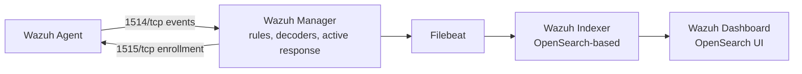

# 🛡️ Wazuh SOC Fundamentals Lab

> **A theory-to-practice learning project for building foundational SOC analyst skills with Wazuh — SIEM/XDR concepts, deployment models, and hands-on detection tasks.**

<p align="center">


</p>

---

## 📖 Overview

This project demonstrates the deployment and configuration of a Security Information and Event Management (SIEM) environment using **Wazuh**. The lab focuses on centralized log collection, security monitoring, detection engineering, and threat analysis using Windows and Linux log sources.

The goal is to simulate real-world Security Operations Center (SOC) workflows including log analysis, alert triage, threat detection, and incident investigation.

---

## 🎯 Objectives

- Understand SIEM/XDR concepts and where Wazuh fits
- Learn Wazuh's architecture and core components
- Understand rules, decoders, and alert severity
- Learn Wazuh's deployment options
- Practice navigating a real SIEM dashboard
- Perform basic detection engineering (writing/tuning rules and decoders)
- Practice the SOC alert triage workflow

---

## 🚀 Learning Outcomes

By working through this repo, you should come away understanding:

- ✅ SIEM vs EDR vs XDR
- ✅ Wazuh architecture (Manager, Agent, Indexer, Dashboard)
- ✅ Log collection & alert generation
- ✅ File Integrity Monitoring (FIM)
- ✅ Vulnerability Detection
- ✅ Security Configuration Assessment (SCA)
- ✅ Detection Engineering (rules, decoders, tuning)
- ✅ MITRE ATT&CK mapping
- ✅ Compliance monitoring (PCI DSS, HIPAA, GDPR, NIST)
- ✅ Incident triage basics

---

## 📚 Table of Contents

- [Overview](#-overview)
- [Objectives](#-objectives)
- [Learning Outcomes](#-learning-outcomes)
- [What is Wazuh?](#-what-is-wazuh)
- [SIEM vs EDR vs XDR](#️-siem-vs-edr-vs-xdr)
- [Wazuh Architecture](#️-wazuh-architecture)
- [Event Processing Pipeline](#-event-processing-pipeline)
- [Core Capabilities](#-core-capabilities)
- [Rules, Decoders & Alerts](#-rules-decoders--alerts)
- [Compliance Frameworks](#-compliance-frameworks)
- [Deployment Methods](#-deployment-methods)
- [License](#-license)
- [Author](#-author)

---

## ❓ What is Wazuh?

**Wazuh** is a free, open-source **SIEM (Security Information and Event Management)** and **XDR (Extended Detection and Response)** platform. It collects, analyzes, and correlates log and telemetry data from endpoints, servers, network devices, and cloud services to detect threats, monitor system integrity, and support incident response and compliance.

Wazuh started as a fork of OSSEC (an open-source HIDS) and has since evolved into a full security monitoring stack combining:
- Log-based intrusion detection
- File Integrity Monitoring (FIM)
- Vulnerability detection
- Security configuration assessment
- Active response (automated remediation)
- Cloud and container security monitoring

### Why organizations use Wazuh
| Need | How Wazuh Helps |
|---|---|
| Centralized visibility | Collects logs from Windows, Linux, macOS, cloud, network devices |
| Threat detection | Correlates events against a rule base and MITRE ATT&CK |
| Compliance | Pre-built rules mapped to PCI DSS, GDPR, HIPAA, NIST 800-53 |
| Cost | 100% open source, no per-agent licensing fee |
| Incident response | Active response module can block IPs, kill processes, etc. |

---

## ⚖️ SIEM vs EDR vs XDR

Wazuh is often described as "SIEM + XDR" because it blends traits of all three categories.

| Feature | SIEM | EDR | XDR |
|---|---|---|---|
| Full form | Security Information and Event Management | Endpoint Detection and Response | Extended Detection and Response |
| Primary focus | Log collection, correlation, analysis | Endpoint monitoring and protection | Unified detection across multiple security layers |
| Data sources | Servers, apps, firewalls, cloud, network devices | Windows/Linux/macOS endpoints | Endpoints, network, cloud, identity, email |
| Response capability | Alert generation | Endpoint isolation, remediation | Automated response across integrated tools |
| Examples | Splunk, QRadar, Elastic SIEM | CrowdStrike Falcon, Defender for Endpoint | Microsoft Defender XDR, Cortex XDR, Wazuh |

Wazuh is unusual in that a single open-source platform covers log-based SIEM detection **and** endpoint-level EDR-style monitoring (FIM, process/registry visibility via Sysmon, vulnerability scanning), which is why it's marketed as an XDR platform rather than a plain SIEM.

---

## 🏛️ Wazuh Architecture

Wazuh follows a **manager–agent** model with a separate indexing and visualization layer.



### Components

The platform consists of four main pieces:

1. **Wazuh Manager** — the central analysis engine. It decodes logs, matches rules, generates alerts, and manages agents (registration, groups, active response). The manager also runs the **API** (TCP `55000`) used for remote management and for the Dashboard to query agent/alert data.
2. **Wazuh Indexer** — a highly scalable search engine (based on OpenSearch) that stores alerts and raw events, enabling fast querying and aggregation.
3. **Wazuh Dashboard** — the web-based UI for threat hunting, visualization, agent administration, and configuration. It queries the Indexer and displays results in real time.
4. **Filebeat** — ships alert data from the Manager's output to the Indexer. (Optional in older versions — in modern Wazuh the Manager can push to the Indexer more directly — but it's still part of most default installs.)

### How Agents Talk to the Manager

Agents communicate with the Manager using **AES-256 encryption** over two TCP ports:
- **Port `1514`** — ongoing event data
- **Port `1515`** — one-time agent enrollment/registration

The Manager's analysis engine processes incoming events through a pipeline of decoders and rules, stores alerts as flat JSON files, and forwards them to the Indexer. The Dashboard then queries the Indexer and presents everything in near real time.

---

## 🔄 Event Processing Pipeline

Once an agent sends data, here's the exact path an event takes before it becomes something you see on the Dashboard:

1. **Collection** — the agent collects log events (syslog, Windows Event Log, application logs) or audit-type events (FIM, registry changes).
2. **Forwarding** — the event is sent encrypted over TCP to the Manager on port `1514` (agents use `1515` only for initial registration).
3. **Pre-decoding** — the Manager extracts basic fields first: timestamp, hostname, program name.
4. **Decoding** — the relevant decoder extracts more structured fields from the log (source IP, username, action taken, etc.).
5. **Rule Matching** — the rule engine compares the decoded fields against its rule sets. If something matches, an alert is generated with a severity level and, where applicable, a MITRE ATT&CK tag.
6. **Alert Enrichment** — extra context gets added, such as GeoIP lookups or threat intelligence data.
7. **Output** — the alert is written to `/var/ossec/logs/alerts/alerts.json` and, if configured, forwarded on to the Indexer.
8. **Indexing** — the Indexer stores the alert and makes it fully searchable.
9. **Visualization** — the Dashboard queries the Indexer and displays the alert in tables, dashboards, and graphs.

> 💡 **Tip:** Understanding this pipeline is fundamental for writing custom rules and troubleshooting false positives. Use `wazuh-logtest` to see exactly how a raw log gets processed, step by step, before it becomes an alert.

---

## 🚀 Core Capabilities

| Module | Description |
|---|---|
| **Log Data Analysis** | Collects and analyzes logs from OS, applications, and devices |
| **File Integrity Monitoring (FIM)** | Detects creation, modification, deletion of monitored files/registry keys |
| **Vulnerability Detection** | Scans installed software against CVE feeds to find known vulnerabilities |
| **Security Configuration Assessment (SCA)** | Audits system hardening against CIS benchmarks |
| **Malware Detection** | Rootcheck and integration with YARA/VirusTotal |
| **Active Response** | Automated actions (block IP via firewall, disable account) triggered by alerts |
| **Cloud Security Monitoring** | AWS, Azure, GCP, Office 365 log ingestion |
| **Container Security** | Docker/Kubernetes monitoring |
| **Regulatory Compliance** | Pre-mapped rules for PCI DSS, HIPAA, GDPR, NIST 800-53 |
| **MITRE ATT&CK Mapping** | Alerts are tagged with corresponding ATT&CK techniques/tactics |
| **Threat Intelligence** | Enriches alerts using feeds like VirusTotal, AbuseIPDB, MISP, AlienVault OTX |

### Common Integrations (reference / future expansion)
- **Sysmon** – richer Windows telemetry (process creation, network connections, registry, DLL loads)
- **Suricata / Zeek** – network-based IDS/NSM
- **VirusTotal / MISP / AbuseIPDB** – threat intel enrichment
- **TheHive** – incident case management
- **Shuffle** – SOAR automation for repetitive response tasks

---

## 🔎 Rules, Decoders & Alerts

- **Decoders** parse raw log lines into structured fields (e.g., extracting `srcip`, `user`, `event_id`).
- **Rules** match decoded fields against conditions to generate alerts.
- **Rule Levels (0–16)** indicate severity:

| Level | Meaning |
|---|---|
| 0 | Ignored, no action |
| 3–4 | Low severity (informational) |
| 5–7 | Medium severity (suspicious activity) |
| 8–12 | High severity (likely attack) |
| 13–16 | Critical (severe attack / compromise) |

Rules live in `/var/ossec/ruleset/rules/` (default) and `/var/ossec/etc/rules/` (custom — always edit custom files, never default ones). Custom rules are written in XML with IDs ≥ 100000 to avoid conflicts:

```xml
<group name="local,custom_rules,">
  <rule id="100010" level="10">
    <if_group>authentication_failed</if_group>
    <same_source_ip />
    <description>Possible brute force attack detected</description>
    <mitre>
      <id>T1110</id>
    </mitre>
  </rule>
</group>
```

---

## 📋 Compliance Frameworks

Wazuh dashboard includes dedicated views for:
- **PCI DSS** – payment card data security
- **GDPR** – data protection for EU citizens
- **HIPAA** – healthcare data protection
- **NIST 800-53** – US federal security controls
- **TSC** – Trust Services Criteria (SOC 2)

Alerts are automatically tagged with the relevant compliance requirement IDs, making audit reporting easier.

---

## 🐳 Deployment Methods

| Deployment | Description | Recommended For |
|---|---|---|
| **Single Node** | All components (Manager, Indexer, Dashboard) on one server | Home labs & small organizations |
| **Multi Node** | Distributed architecture — separate Manager, Indexer, and Dashboard nodes with load balancing | Enterprises, high availability |
| **Docker** | Containerized deployment using the official Docker Compose stack | Learning, testing, repeatable home labs |
| **OVA Appliance** | Preconfigured virtual machine with everything installed | Quick evaluation/demos |
| **Cloud Deployment** | Cloud-hosted installation (AWS, Azure, GCP) | Cloud-native environments |

Each method reaches the same end state — a Manager listening on 1514/1515 for agents — so the choice mostly comes down to how much you want to manage yourself versus how quickly you want something running.

---


**Nypunya Mallarapu**

SOC Analyst | Blue Team | SIEM | Detection Engineering

---

⭐ This repository is actively being developed as part of my SOC Analyst and Detection Engineering learning journey.
