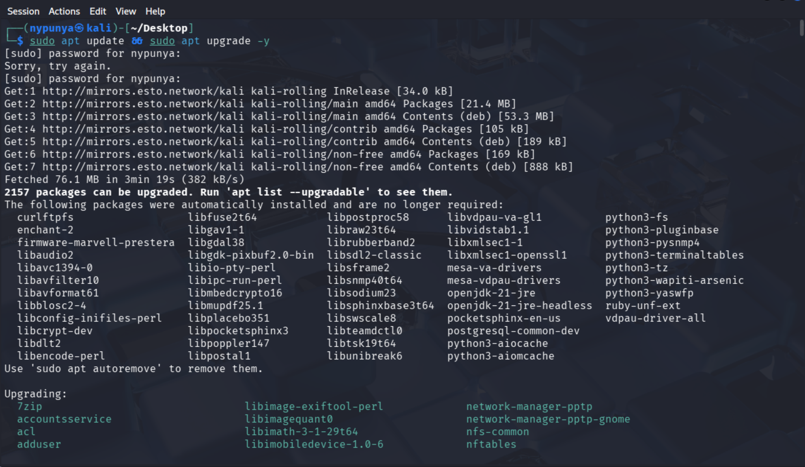
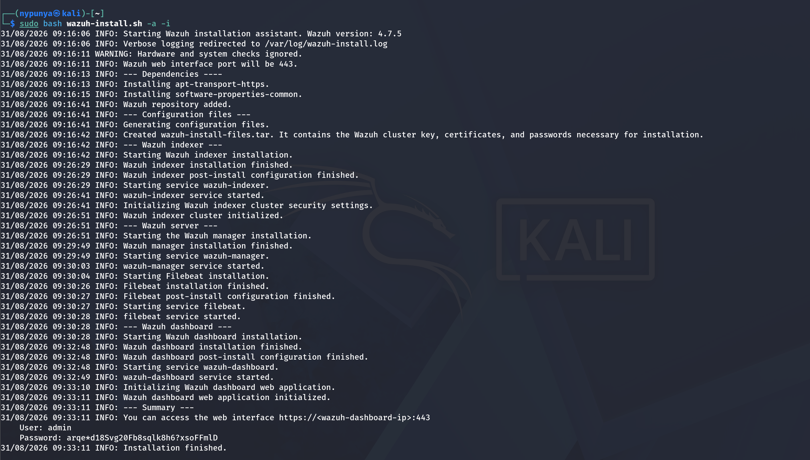
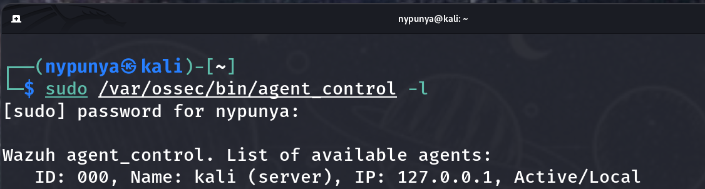
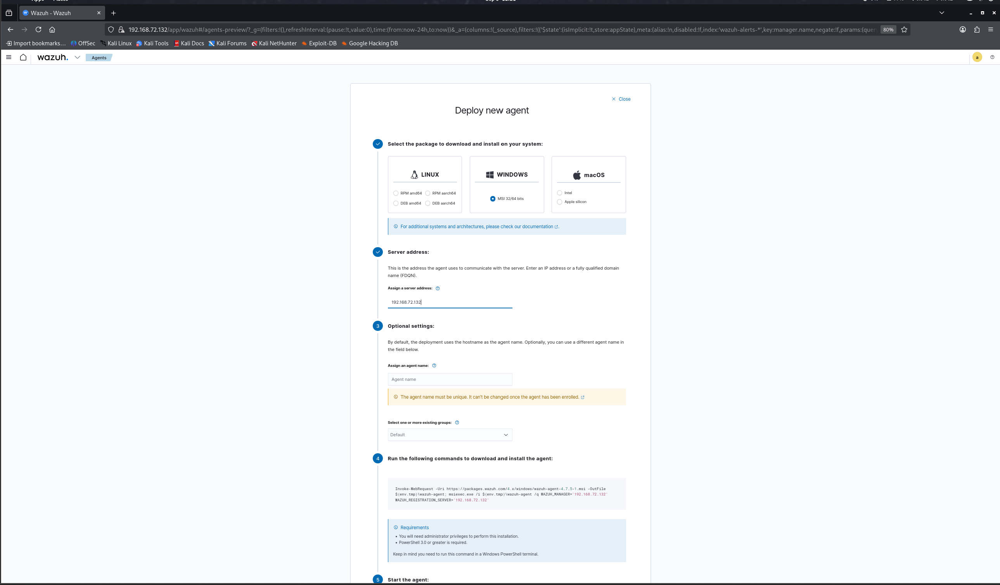
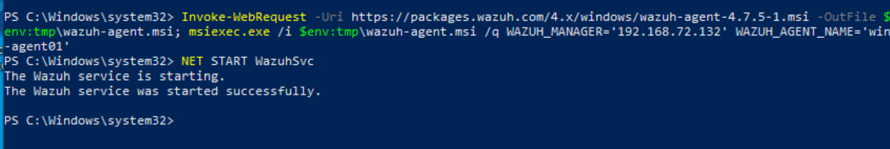
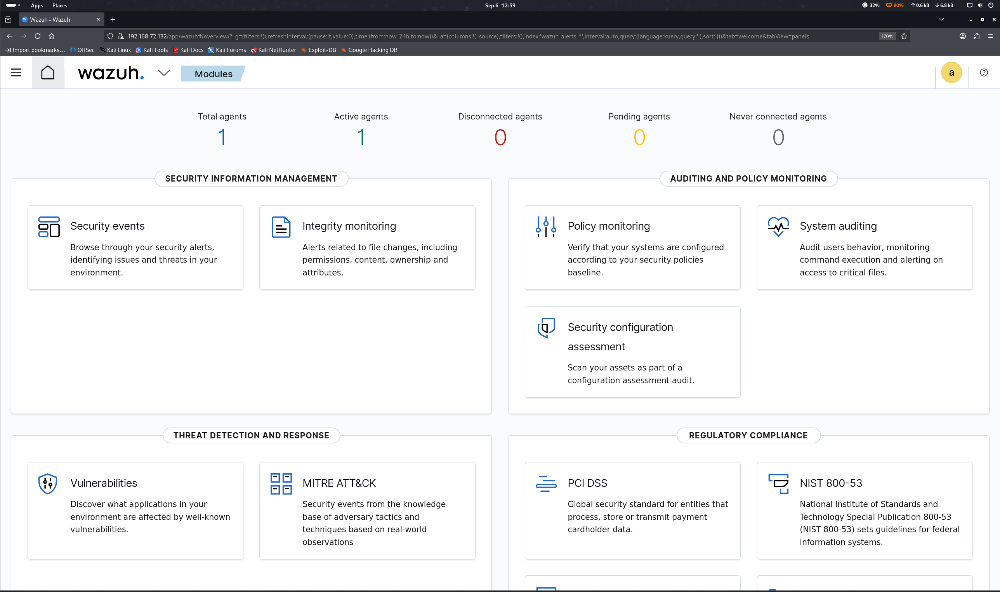
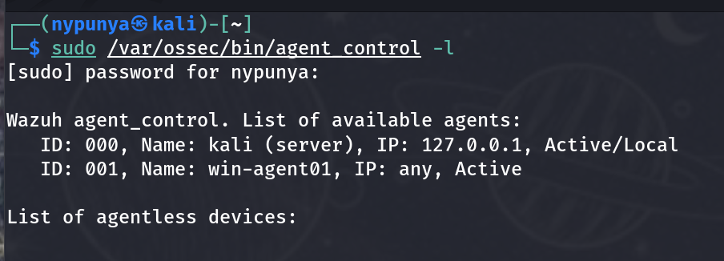

# ⚙️ Wazuh Setup — Kali Manager + Windows Agent

This document walks through the actual setup performed for this lab: installing the Wazuh Manager stack on Kali Linux, confirming Kali's own built-in local agent, and enrolling a Windows 10 VM as a monitored agent — with screenshots from each step.

> 📸 Screenshots referenced below are in the `wazuh-setup/` folder in this repo.

---

## Step 1 — Update & Upgrade Kali

```bash
sudo apt update && sudo apt upgrade -y
```



---

## Step 2 — Download the Wazuh Install Script

```bash
curl -sO https://packages.wazuh.com/4.7/wazuh-install.sh
```


---

## Step 3 — Run the Install Script

```bash
sudo bash wazuh-install.sh -a -i
```

- `-a` installs the Manager, Indexer, and Dashboard together (single-node).
- `-i` ignores hardware/system checks (used here since Kali isn't on Wazuh's officially supported OS list, but the install still works fine).

The script installs the Indexer, then the Manager, then Filebeat, then the Dashboard — each step logs a "finished" line. At the end, it prints the Dashboard URL and the auto-generated `admin` login credentials.



> Save the `admin` password shown at the end — you'll need it to log into the Dashboard in Step 5 onward. It can also be retrieved later from `wazuh-install-files.tar` if missed.

---

## Step 4 — Confirm Kali's Built-In Local Agent

Kali (the Manager itself) automatically registers itself as agent `000` — no separate agent install is needed for the Manager machine. Confirm it's active:

```bash
sudo /var/ossec/bin/agent_control -l
```



Output confirms:
```
ID: 000, Name: kali (server), IP: 127.0.0.1, Active/Local
```

---

## Step 5 — Deploy a New Agent (Windows) via the Dashboard

Log into the Wazuh Dashboard at `https://<kali-ip>` as `admin`, then go to:
```
https://<kali-ip>/app/wz-home#/agents-preview
```
Click **Deploy new agent**, then:
1. Select **Windows → MSI 32/64 bits**
2. Enter the Manager's server address (Kali's IP)
3. (Optional) Assign an agent name — this lab used `win-agent01`
4. The wizard generates a ready-to-run PowerShell install command



---

## Step 6 — Run the Generated Command on the Windows 10 VM

On the Windows 10 VM, open **PowerShell as Administrator** and run the exact command generated by the wizard, then start the service:

```powershell
Invoke-WebRequest -Uri https://packages.wazuh.com/4.x/windows/wazuh-agent-4.7.5-1.msi -OutFile $env:tmp\wazuh-agent.msi; msiexec.exe /i $env:tmp\wazuh-agent.msi /q WAZUH_MANAGER='192.168.72.132' WAZUH_AGENT_NAME='win-agent01'
NET START WazuhSvc
```



---

## Step 7 — Check the Dashboard's Modules Overview

Back on the Dashboard, the **Modules** overview page shows the agent count updating:



> Agent status here depends on whether the Windows VM is currently powered on and reachable — it may briefly show as **Disconnected** if the VM was off or just booting when the page loaded. Once it's fully up and connected, status updates to **Active** (confirmed in Step 8).

---

## Step 8 — Verify Both Agents Are Active

Back on the Dashboard, go to the **Agents** page (`https://<kali-ip>/app/wz-home#/agents-preview`). With the Windows 10 VM powered on and connected, `win-agent01` now shows as **Active**:



The dashboard confirms:
- **Status:** Active (1), Disconnected (0), Pending (0), Never connected (0) — **100% agent coverage**
- **Last registered agent / Most active agent:** `win-agent01`
- **Agent details:** ID `001`, IP `192.168.72.129`, OS `Microsoft Windows 10 Pro 10.0.19045.3803`, Version `v4.7.5`, Status `active`

This confirms the Windows agent is fully enrolled and actively reporting to the Manager — not just registered.

---

## Summary

| Component | Status |
|---|---|
| Wazuh Manager (Kali) | ✅ Installed and running |
| Kali local agent (`000`) | ✅ Active/Local |
| Windows 10 agent (`win-agent01`, `001`) | ✅ Active — 100% agent coverage |
